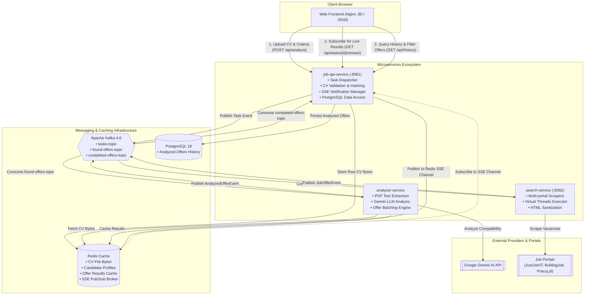

# 🚀 Job Searcher Bot

An AI-powered, event-driven microservice platform that parses IT job vacancy portals, extracts and evaluates vacancy requirements against a candidate's PDF resume using **Google Gemini LLM**, and streams personalized match scores (0–100%) and justifications in real-time.

---

## 🌟 Key Features

* **⚡ Concurrent Web Scraping with Virtual Threads**: Simultaneously searches and extracts job listings from top Polish IT portals (**JustJoin IT**, **BulldogJob**, **Pracuj.pl**) using Java 21 Virtual Threads and resilient HTTP clients.
* **🧠 AI-Powered Resume & Vacancy Matching**: Uses **Google Gemini** (via Spring AI) to parse CV contents and provide an objective compatibility score (0–100%) along with bulleted reasoning for each job offer.
* **📡 Real-Time Live Streaming (SSE)**: Streams analyzed vacancies to the user's browser in real time over **Server-Sent Events (SSE)** powered by Redis Pub/Sub.
* **🔄 Event-Driven Architecture**: Decoupled microservices communicating asynchronously over **Apache Kafka** with retry topics and Dead Letter Topics (DLT).
* **⚡ Multi-Tier Redis Caching**: Caches raw resume byte arrays, structured candidate profiles, and historical offer match results to prevent redundant AI queries and scraper loads.
* **📊 Offer History & Advanced Filtering**: PostgreSQL persistence of analyzed offers with company name tracking, keyword search, score tier filtering, and paginated history.
* **🐳 Fully Dockerized**: Pre-configured Docker multi-stage builds, Nginx static frontend, PostgreSQL, Redis, Apache Kafka (KRaft mode), and Kafka UI dashboard.

---

## 🏗️ Architecture Schema



---

## 🧩 Microservices Breakdown

### 1. `job-api-service` (Port: `8081`)
* **Role**: REST API Gateway, Task Dispatcher, SSE Notification Hub, and Offer History Management.
* **Key Responsibilities**:
  * Validates and hashes PDF resumes (SHA-256) with a 5MB size limit.
  * Caches raw CV bytes in Redis under the `taskId`.
  * Emits task events to `tasks-topic`.
  * Listens to `completed-offers-topic` and publishes updates to Redis Pub/Sub for SSE delivery.
  * Saves analyzed offers (including company name, job title, match score, and justification) to PostgreSQL with indexing for high-speed pagination, score filtering, and keyword search.

### 2. `search-service` (Port: `8082`)
* **Role**: High-throughput scraper and data normalizer.
* **Key Responsibilities**:
  * Consumes tasks from `tasks-topic`.
  * Concurrently queries job portals (**JustJoin IT**, **BulldogJob**, **Pracuj.pl**) using Java 21 Virtual Threads.
  * Sanitizes, cleans HTML entities, and normalizes vacancies into a standardized schema (`JobOffer`).
  * Emits individual `JobOfferEvent` messages and a trailing `SEARCH_FINISHED` event to `found-offers-topic`.

### 3. `analyzer-service`
* **Role**: Core AI analytical engine.
* **Key Responsibilities**:
  * Consumes raw job offers from `found-offers-topic`.
  * Retrieves and parses the candidate's CV from Redis using **Apache PDFBox**.
  * Caches structured candidate profiles in Redis to avoid re-parsing.
  * Buffers vacancies into batches (up to 20) and queries **Google Gemini Flash** via Spring AI.
  * Outputs compatibility score (0–100%) and explanatory feedback with company name association.
  * Emits evaluation results and `ANALYSIS_FINISHED` events to `completed-offers-topic`.

### 4. `frontend` (Port: `80` / `5500`)
* **Role**: Responsive Web Client served via Nginx.
* **Key Responsibilities**:
  * **Landing Page (`home.html`)**: Features overview, guidelines, and quick navigation to analysis.
  * **AI Analyzer (`analyzer.html`)**: Resume drag-and-drop uploader, technology/experience selector, and real-time SSE offer stream with score tier badges (Urgent, High, Mid, Low) and company badges.
  * **History Page (`history.html`)**: Search, score range filters, sort orders, and paginated archive of past evaluations.

---

## 📬 Kafka Topics & Data Flow

| Topic Name | Producer | Consumer | Payload Event | Description |
| :--- | :--- | :--- | :--- | :--- |
| `tasks-topic` | `job-api-service` | `search-service` | `CreatedTaskEvent` | New resume analysis task with search criteria |
| `found-offers-topic` | `search-service` | `analyzer-service` | `JobOfferEvent` | Scraped job vacancy or `SEARCH_FINISHED` signal |
| `completed-offers-topic` | `analyzer-service` | `job-api-service` | `AnalyzedOfferEvent` | Match score, reason, or `ANALYSIS_FINISHED` signal |

---

## 🛠️ Tech Stack

* **Backend**: Java 21, Spring Boot 4.1.0, Spring AI 2.0.0, Spring Data JPA
* **AI Model**: Google Gemini (`gemini-3.5-flash-lite`)
* **Messaging & Cache**: Apache Kafka 4.0 (KRaft), Redis
* **Database**: PostgreSQL 18
* **Document & Web Parsing**: Apache PDFBox, JSoup
* **Frontend**: HTML5, CSS3, JavaScript (SSE, Fetch API), Nginx
* **DevOps**: Docker, Docker Compose, Multi-stage builds

---

## 🚀 Getting Started & How to Run

### 1. Prerequisites
* [Docker Desktop](https://www.docker.com/products/docker-desktop/) (v24.0+ recommended)
* [Docker Compose](https://docs.docker.com/compose/) (v2.0+)
* A valid **Google Gemini API Key** ([Google AI Studio](https://aistudio.google.com/))

---

### 2. Environment Configuration
Create a `.env` file in the root directory by copying `.env.example`:

```bash
cp .env.example .env
```

Fill in the required environment variables in `.env`:

```ini
DB_USERNAME=postgres
DB_PASSWORD=postgres
GEMINI_API_KEY=your_google_gemini_api_key_here
```

---

### 3. Launching with Docker Compose

Build and start all services, databases, Kafka brokers, and the frontend with one command:

```bash
docker compose up --build
```

To run in detached (background) mode:
```bash
docker compose up --build -d
```

To stop and remove containers and networks:
```bash
docker compose down
```

---

### 4. Service Endpoints & UI Access

Once started, access the application and management tools via your browser:

| Service / Tool | URL | Description |
| :--- | :--- | :--- |
| **Frontend Web App** | [http://localhost](http://localhost) or [http://localhost:5500](http://localhost:5500) | Main User Interface |
| **Job API Service** | [http://localhost:8081](http://localhost:8081) | Core REST API & SSE Endpoints |
| **Search Service** | [http://localhost:8082](http://localhost:8082) | Portal Scraper Microservice |
| **Kafka UI Dashboard** | [http://localhost:8080](http://localhost:8080) | Kafka Cluster & Topics Visualizer |
| **PostgreSQL Database** | `localhost:5432` (`db: job-searcher`) | Relational Data Store |
| **Redis Cache** | `localhost:6379` | In-memory Cache & Pub/Sub |

---

### 5. Running Services Locally (Development Mode)

If you prefer to run services individually for local development:

1. **Start infrastructure dependencies**:
   ```bash
   docker compose up -d postgres redis kafka kafka-ui
   ```

2. **Run each microservice via Maven**:
   ```bash
   # Terminal 1: API Service
   cd job-api-service
   ./mvnw spring-boot:run

   # Terminal 2: Search Service
   cd search-service
   ./mvnw spring-boot:run

   # Terminal 3: Analyzer Service
   cd analyzer-service
   ./mvnw spring-boot:run
   ```

3. **Open Frontend**:
   Open `frontend/index.html` using VS Code Live Server (`http://localhost:5500`) or open `frontend/homePage/home.html` in your browser.
